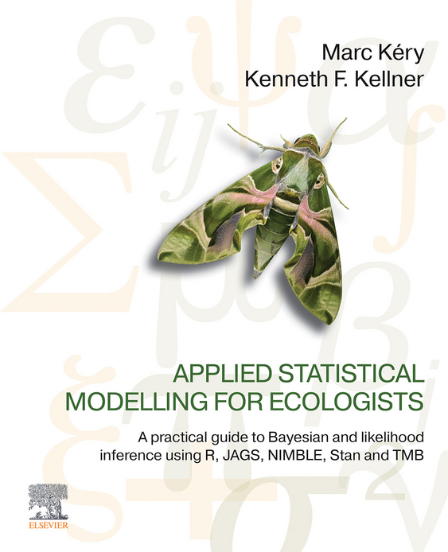

 

Buy the book from [Elsevier](https://shop.elsevier.com/books/applied-statistical-modelling-for-ecologists/kery/978-0-443-13715-0).

 

# Description

Applied Statistical Modelling for Ecologists: A Practical Guide to Bayesian and Likelihood Inference Using R, JAGS/Nimble, Stan and TMB provides an important guide and comparison of powerful new software packages that are now widely used in research publications, including JAGS, Stan, Nimble, and TMB. It provides a gentle introduction to the most exciting specialist software that is often used to conduct cutting-edge research, along with Bayesian statistics and frequentist statistics with its maximum likelihood estimation method. In addition, this book is simple and accessible, allowing researchers to carry out and understand statistical modeling.

Through examples, the book covers the underlying statistical models widely used by scientists across many disciplines. Thus, this book will be useful for anyone who needs to quickly become proficient in statistical modeling, and in the model-fitting engines covered.

